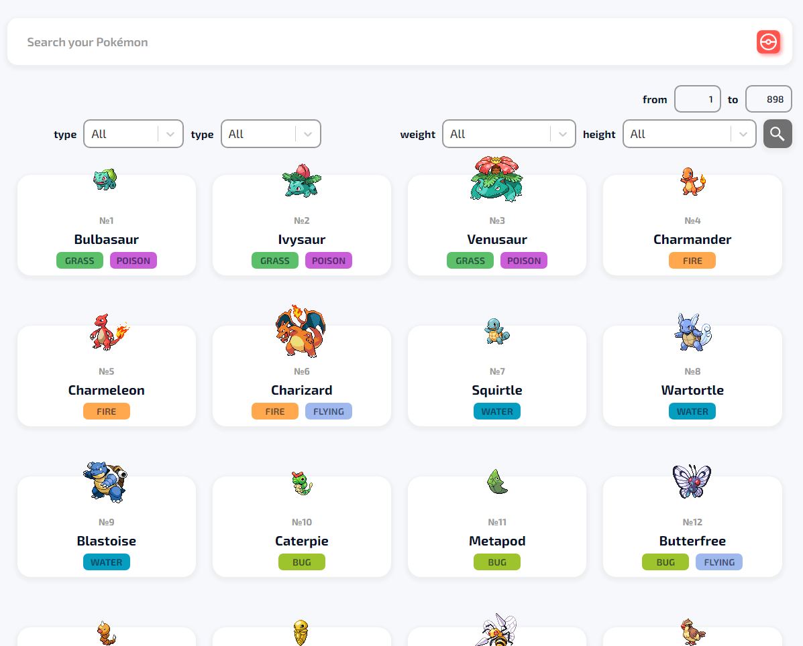

<h1 align="center">Pokédex</h1>
<p align="center"></p>
<p>
  App built with React, Redux, Redux Thunk, Chakra UI, Poke API, Formik, Sass, Bootstrap
</p>
<h2 align="center"><a  href="https://mrjeleika.github.io/pokedex/">Live Demo</a></h2>

## Description
Pokédex is catalog of information regarding the various species of Pokémon.

## Project setup
```
git clone https://github.com/MrJeleika/pokedex.git
```
<h4>
npm
</h4>
```
npm install
npm start
```

<h4>
yarn
</h4>
```
yarn
yarn start
```
